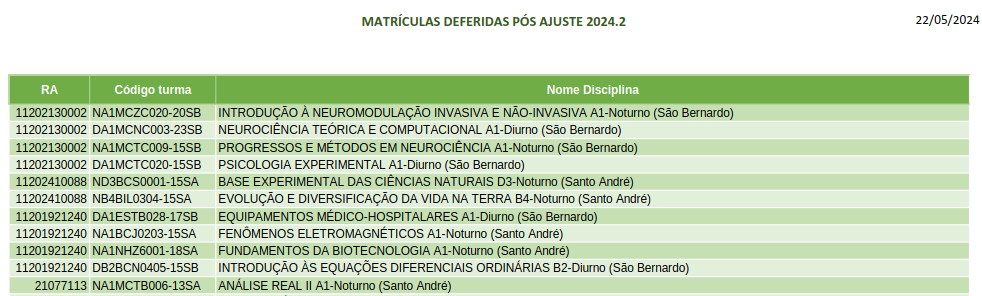

# UFABC Enrollment Filter

Webpage to filter UFABC enrollment

## 📄 PDF Parser

This Go program downloads a PDF from a URL provided via the command line, parses table content from the PDF, and saves it as a CSV file. The table in the PDF should contain the columns "RA", "Código turma", and "Nome Disciplina" as the following [example](https://prograd.ufabc.edu.br/pdf/ajuste_2024_2_matriculas_deferidas.pdf):

<p align="center">
    
</p>

### ⚙️ Prerequisites

Before running the program, ensure you have Go installed on your system. You can download and install Go from [the official website](https://go.dev/doc/install).

### 🚀 Usage

1. In your terminal navigate to the directory containing the script.

2. Run the script with the URL of the PDF as a command-line argument:

   ```sh
   go run main.go http://example.com/yourfile.pdf
   ```

   Replace `http://example.com/yourfile.pdf` with the actual URL of the PDF you want to process.

### 📂 Output

The program will download the PDF from the provided URL, parse the table data, and save the parsed data to a CSV file named `output.csv` in the same directory.

## 📜 License

This project is licensed under the MIT License. See the [LICENSE](LICENSE) file for details.

